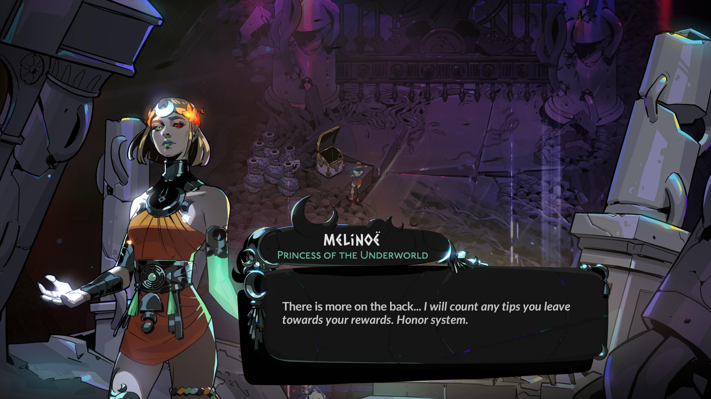
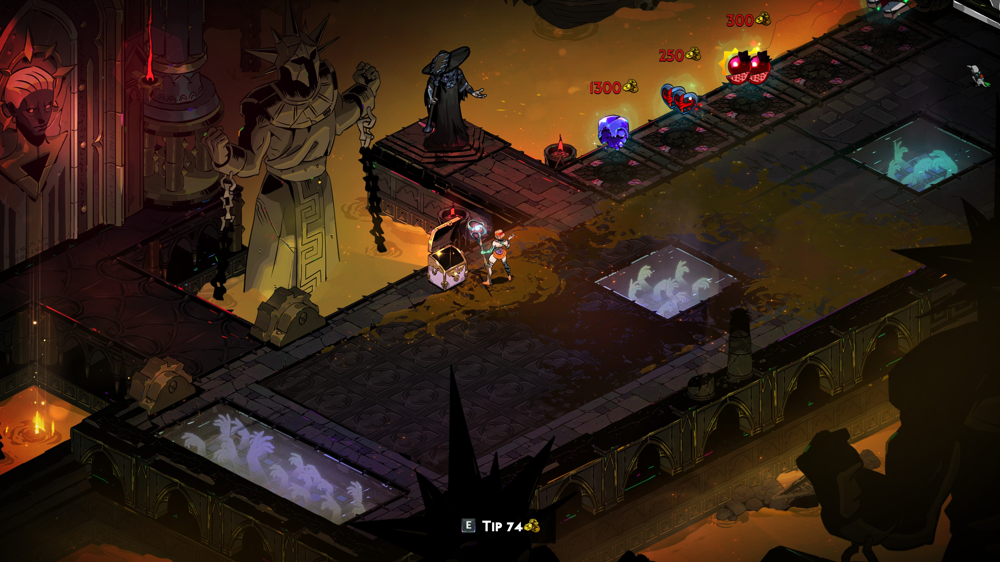
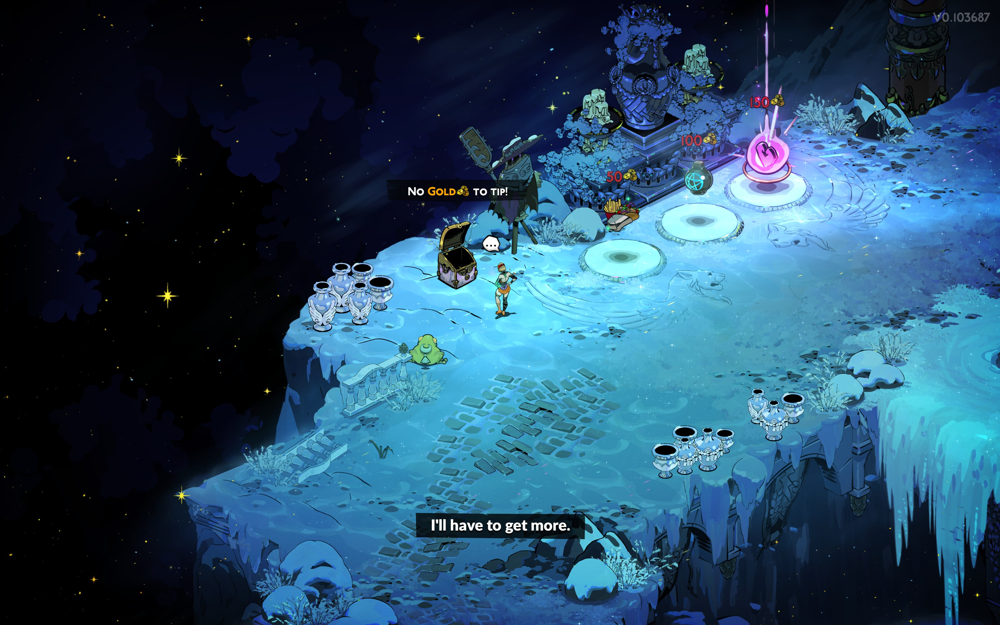

# Charon's Tip Jar

This mod allows you to tip any unspent Gold to Charon in the shop before the final boss of a run, including during Dream Dives.
A "tip jar" will appear next to Charon, and interacting with it will tip all Gold in your possession to Charon.

When participating in a Chaos trial, a tip jar will also be conveniently placed in the shop room just before the final boss of the trial as well, no matter the region it takes place in.

The mod is also compatible with [Zagreus' Journey](https://thunderstore.io/c/hades-ii/p/NikkelM/Zagreus_Journey/), and will place tip jars in Tartarus, Asphodel, Elysium and the Temple of Styx according to the same rules.

Tipped Gold will count towards Obol point (reward cards) progress with Charon.

> *No refunds*
>  &nbsp;&nbsp;&nbsp;&nbsp; \- Charon

### Contribute

You can contribute to this mod by providing a translation for your native language!
To learn how to, take a look at the [localization guide](https://github.com/NikkelM/Hades-II-CharonsTipJar/blob/main/src/Game/Text/README.md).

The mod is currently available in the following languages:

- English
- German
- Simplified Chinese (by Doro)
